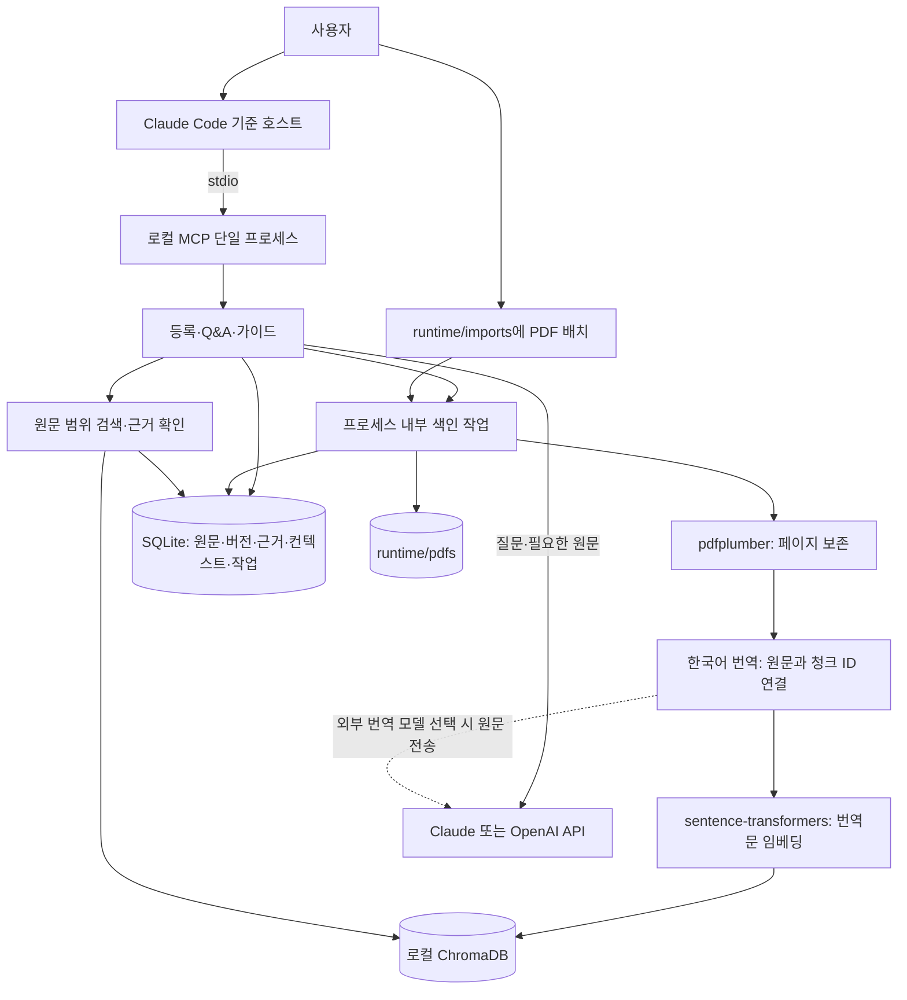

# 22. M1 로컬 실행 기준과 기술 스택

작성일: 2026-09-07  
상태: 사용자 요청 반영 / 로컬 M1 방향 확정, 구현·호환성 검증 전

## 적용 범위와 문서 우선순위

M1은 개인 PC에서 실행하는 단일 사용자 MCP 서비스로 개발한다. 기존 코드는 재사용하지 않고 새 골격에서 구현한다. 팀원 C PDF의 기술 선택을 참고하되 PDF의 구현·검증 완료 표시는 승계하지 않는다.

이 문서와 갱신된 04·05·06·10·11·12·13·15·16·21번 문서가 현재 기준이다. 상세 07·08·09·14·18·19·20번에는 이전 공동 서버 설계와 평가 계획을 참고 이력으로 남긴다. 각 문서 상단의 로컬 적용 범위가 본문보다 우선한다. 공동 서버는 장기 방향으로 보존하되 M1 출시 조건에서 제외한다. 인용 그래프·다중 논문·대시보드는 여전히 M2다.

## 기술 스택

| 영역 | M1 선택 | 미결정·검증 사항 |
|---|---|---|
| 언어·MCP | Python + 공식 MCP Python SDK, stdio | SDK 버전·기준 Python 세부 버전 |
| 기준 호스트 | Claude Code 우선 연결 검증 | 실제 OS·앱·계정 환경 및 설치 절차 |
| PDF | pdfplumber, 페이지 단위 추출·청킹 | 2단·표·수식 추출 품질, 청크 크기 |
| 한국어 번역 | 추출 원문을 보존한 뒤 청크별 번역 생성 | 번역 제공자·모델·프롬프트·리비전 미정 |
| 관계형 데이터 | Python sqlite3 + 로컬 SQLite 파일 | DDL·마이그레이션 구현 |
| 벡터 저장 | 로컬 영속 ChromaDB | 컬렉션·거리 설정과 필터 검증 |
| 임베딩 | sentence-transformers로 다국어 모델 로컬 실행 | 정확한 모델 ID·리비전·차원·CPU 성능 |
| 생성·의미 검증 | Claude 또는 OpenAI API 중 한 제공자로 시작 | 모델·SDK·토큰·비용 상한; 검증은 동일 모델 별도 호출 가능 |
| 파일 | runtime/pdfs 및 runtime/imports | 로컬 저장·용량·삭제 설정 |
| URL | requests로 허용된 HTTPS PDF 수집 | 허용 출처·다운로드 제한·리다이렉트 검사 |
| 작업 처리 | 동일 MCP 프로세스의 백그라운드 작업, SQLite 상태 기록 | 동시에 색인 1건, 블로킹 작업 offload·상태 조회 검증 |
| 설정 | 환경변수 또는 Git 제외 .env | .env 자동 로드는 구현 전; 키는 로컬에서만 설정 |
| Skill | 읽기 편의를 위한 선택적 지침 | 핵심 Q&A·가이드는 Tool로도 접근 가능 |

sentence-transformers는 구체적인 모델명이 아니다. Claude/OpenAI도 모델 선택 완료를 뜻하지 않는다. 개발 의존성 목록은 설치 의도를 기록하며 lockfile·환경 호환성 검증은 별도다.

## 실행과 데이터 흐름



단일 프로세스는 모든 작업을 동기 실행한다는 뜻이 아니다. 등록은 job_id를 반환하고 프로세스 내부 작업이 PDF 처리·임베딩을 진행한다. 블로킹 연산이 MCP 상태 조회를 막지 않도록 제한된 executor 등을 검증한다. 별도 worker 서버·메시지 브로커·HTTP 서버는 M1 필수가 아니다.

프로세스 종료 시 백그라운드 작업도 멈춘다. 재시작 시 남은 processing 작업을 interrupted로 기록하고 사용자가 명시적으로 재시도한다. 프로세스 밖에서 자동으로 계속 실행된다고 안내하지 않는다. 부분 색인은 검색 대상에서 제외하고 반복 실행 시 중복·고아 레코드를 정리한다.

## 데이터·검색 원칙

- SQLite가 원문·페이지·삭제 상태의 기준이다. ChromaDB는 재구축 가능한 검색 파생 데이터다.
- 최소 논리 단위는 논문, 원본 버전, 파싱 결과, 청크, 임베딩 설정, 근거, 학습 컨텍스트, 처리 작업이다.
- 기본 저장·전달·검색 텍스트인 text는 한국어 번역문이다. original_text에 추출 원문을 별도 보존한다. 원문 중심으로 변경할 가능성을 남긴다.
- 사용자에게는 printed_page_label(문자열)의 인쇄 번호를 우선 표시한다. 실제 파일 위치 pdf_page는 1부터 시작하는 물리 페이지로 별도 보관한다. 청크는 처음에는 물리 페이지를 넘기지 않는다. section은 모르면 null이다.
- 파일 변경은 새 version_id, 재파싱은 새 parse_revision_id, 임베딩 변경은 새 embedding_set_id로 구분한다.
- 각 임베딩 설정·파싱 결과에 연결한 Chroma 컬렉션 또는 검증된 필터로 검색 범위를 제한한다. 질문과 청크는 같은 모델·전처리를 사용한다.
- SQLite FK는 연결마다 활성화하고 테스트한다. Chroma에는 SQLite 복합 FK를 적용할 수 없으므로 안정적인 청크 ID로 대조한다.
- SQLite와 Chroma 쓰기는 하나의 트랜잭션이 아니다. 파생 색인을 먼저 준비·검증한 후 SQLite의 ready 상태·활성 참조를 게시한다. 실패 시 재구축/정리한다.
- 삭제는 SQLite에서 접근 차단 후 파일·벡터·컨텍스트 정리 순서다. 외부에서 사용자가 제공한 원본 파일은 삭제하지 않는다.
- 키워드 검색과 벡터 검색을 결합하는 기존 방향은 유지하되 구체적인 키워드 검색 구현은 미정이다. PostgreSQL SQL이나 pgvector 인덱스 전제는 적용하지 않는다.

## 텍스트·페이지 합의 (2026-09-07)

| 필드 | 의미·규칙 |
|---|---|
| text | 기본 한국어 번역문; 번역 실패 시 원문을 몰래 넣지 않음 |
| original_text | PDF에서 추출한 원문; 검증·재번역의 기준 |
| translation_revision_id | 번역 결과 식별자; 제공자·모델/버전·프롬프트 버전·생성 시각을 별도 메타데이터로 연결 |
| printed_page_label | 확인한 인쇄 번호. "3", "iv", "A-1"처럼 문자열; 없거나 불확실하면 null |
| pdf_page | PDF 내 물리 위치, 첫 페이지=1; 파일 이동과 원문 검증에 사용 |

```json
{
  "chunk_id": "chunk_001",
  "text": "한국어로 번역된 논문 내용",
  "original_text": "Original text extracted from the paper.",
  "translation_revision_id": "translation_001",
  "printed_page_label": "3",
  "pdf_page": 5
}
```

예시는 실제 논문 인용이 아니다. 표시에는 '논문 3페이지', 파일 이동에는 PDF 다섯 번째 페이지를 사용한다. 인쇄 번호가 없거나 판독이 불확실하면 추측하지 않고 'PDF 기준 5페이지'로 대체한다. 인쇄 번호는 중복될 수 있으므로 식별자나 단독 탐색 키로 쓰지 않는다. pdfplumber의 페이지 순서를 인쇄 번호라고 간주하지 않으며, 별도 추출·검수로 확인한다. 자동 인식 방식은 미정이다.

등록 흐름은 페이지별 원문 추출·청킹 → 인쇄 번호 확인 → 한국어 번역 → 번역문 임베딩이다. 번역은 청크 ID와 원문에 연결해 저장한다. 일부 번역 실패 시 해당 구간은 검색에서 제외하고 제한을 표시하며, 정상 번역 구간이 없다면 ready로 게시하지 않는다.

검색·생성에는 text를 기본으로 사용하지만 수치·수식·인과·비교 검증에는 original_text를 함께 확인한다. 한국어 인용은 '한국어 번역'이라고 표시하고 실제 원문 인용과 구분한다. 번역문에서 찾은 문자 위치를 원문의 동일 위치로 간주하지 않는다. quote_ko와 quote_original은 같은 evidence_id 아래 각 텍스트에 대해 별도로 검사하며 의미 대응도 확인한다.

재번역 시 기존 근거를 덮어쓰지 않고 새 translation_revision_id를 만든다. context·Evidence·임베딩 설정은 사용한 번역 리비전을 고정한다. 번역 내용 또는 원문/번역문 검색 정책을 바꾸면 새 embedding_set_id로 재색인하고 검증 후 전환한다. 이미 추출한 원문은 재사용한다.

## 로컬 파일 입력과 사용자 경계

M1은 사용자가 설정한 로컬 데이터 루트 한 곳, OS 사용자 한 명을 신뢰 경계로 삼는다. 서비스 로그인·OAuth·계정 간 공유는 없다. local_profile_id는 서버가 내부 생성하는 식별자이지 인증 토큰이 아니다. 임의 입력 user_id를 신뢰하지 않는다.

첫 파일 등록은 사용자가 runtime/imports에 복사한 PDF의 상대 경로를 받는다. resolve한 실제 경로가 import 루트 안의 일반 PDF인지 검사하며 상위 경로 탈출, 절대 경로, symlink/junction을 통한 탈출을 거부한다. 로컬 MCP가 컴퓨터 전체를 읽는 도구가 되어서는 안 된다. 챗봇 첨부가 자동 전달된다고 가정하지 않는다.

정식 업로드 웹 화면·HTTP API는 후속 공동 서버 단계로 미룬다. 원문 근거는 파일명·페이지·인용문을 기본으로 반환하고 실제 파일 열기 지원은 호스트별로 검증한다.

## 외부 전송과 URL 범위

로컬 실행은 완전 오프라인/local-only를 뜻하지 않는다. 임베딩은 로컬에서 처리하지만 모델 최초 다운로드·논문 URL 수집·호스트 대화·생성 API에는 네트워크가 필요할 수 있다. 생성 API에는 질문과 필요한 원문을 보내며 사용자에게 이를 안내한다. API 비용과 챗봇 구독은 별도다.

번역을 외부 API로 수행한다면 등록 단계에서 번역 대상 원문 전체가 청크 단위로 전송될 수 있다. 질문 시 일부 근거만 전송하는 것과 구분해서 안내하고 등록 시간·번역 비용·재시도 비용을 측정한다. 번역 제공자는 아직 선택하지 않았다.

C 안의 임의 HTML 본문 fallback과 외부 제목 검색은 기술스택 변경만으로 추가하지 않는다. 원문 PDF를 확보하지 못하면 PDF 파일 등록을 안내한다. title 검색은 현재 로컬 등록 목록으로 제한한다. 외부 학술 검색은 별도 범위 결정 후 추가한다.

URL은 HTTPS·허용 출처·응답 크기·시간을 제한하고 DNS 및 모든 리다이렉트에서 사설망·메타데이터 주소 접근을 차단한다. requests 도입 자체가 이 보안을 제공하지 않는다.

## 품질·보안·3주 목표

근거 ID·페이지·원문 일치, 수치·비교·인과 검증 및 근거 부족 응답 원칙은 유지한다. 선수 개념은 LLM 후보 + 팀 검수로 시작하고, 검수 계획이 없으면 일반 섹션 가이드로 제한한다.

1주 차: 로컬 stdio 연결 + PDF 1편 검색·근거 답변.
2주 차: 상태·중단 처리·삭제·제한 안내 + 목적별 요약/가이드.
3주 차: 다른 팀원의 PC에서 설치·실행, 샘플 평가·오류 수정·시연.

계정 간 격리 대신 허용 폴더 탈출·잘못된 논문/버전 조회·삭제된 근거 접근·API 키 노출을 차단한다. 공동 서버 전환 시 인증·사용자 격리·원격 파일 전달을 새로 구현·검증해야 한다.

## 후속 공동 서버 전환

원격 MCP transport, 인증·권한, 객체 저장소, API/worker 분리, DB 전환은 후속 단계의 별도 결정이다. 어댑터·안정적인 ID를 유지하지만 자동 이관을 보장하지 않는다. 로컬 DB나 파일을 사용자 동의 없이 공동 서버로 업로드하지 않는다.

## 공식 기술 자료

- [MCP Python SDK](https://github.com/modelcontextprotocol/python-sdk)
- [pdfplumber](https://github.com/jsvine/pdfplumber)
- [Sentence Transformers 설치](https://sbert.net/docs/installation.html)
- [Chroma 로컬 영속 클라이언트](https://docs.trychroma.com/reference/python)
